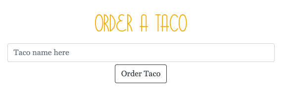
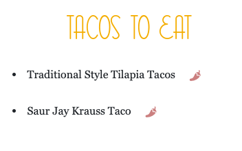

***

###  An App to Log Your Taco Eating Adventures!

***

## Overview

Tacos for the People is a full-stack app that utlizes node express and handlebars. It is deployed on heroku using a JAWSDB/SQL database to RESTfully create, read, update, and delete taco data. Back-end files are stored in a MVC structure.

## How it Works

* Users can input what kind of taco they want to eat


---

* Upon submission, the app will display the taco on the left side of the page -- waiting to be devoured

* Each Taco in the Taco Queue also has a `Devour` button (a hot pepper)

<kbd>
  
</kbd>

---

* When the user clicks it, the taco will move to the right side of the page.


---

* As long as the taco is on the page, it will be stored in the database, whether devoured or not.

* The user has an option to erase taco evidence (if they've eaten an embarassing taco) by clicking the `x` button in the devoured taco list


## Packages and Tools

* Node.js

* Express

* Express-Handlebars

* MySQL

* JAWSDB

* Heroku

## File Structure

```
.
├── config
│   ├── connection.js
│   └── orm.js
│ 
├── controllers
│   └── tacos_controller.js
│
├── db
│   ├── schema.sql
│   └── seeds.sql
│
├── models
│   └── taco.js
│ 
├── node_modules
│ 
├── package.json
│
├── public
│   └── assets
│       ├── css
│       │   └── style.css
│       └── img
│       │ 
│       └── js
│           └── tacos.js
│
├── server.js
│
└── views
    ├── index.handlebars
    └── layouts
        └── main.handlebars
```
